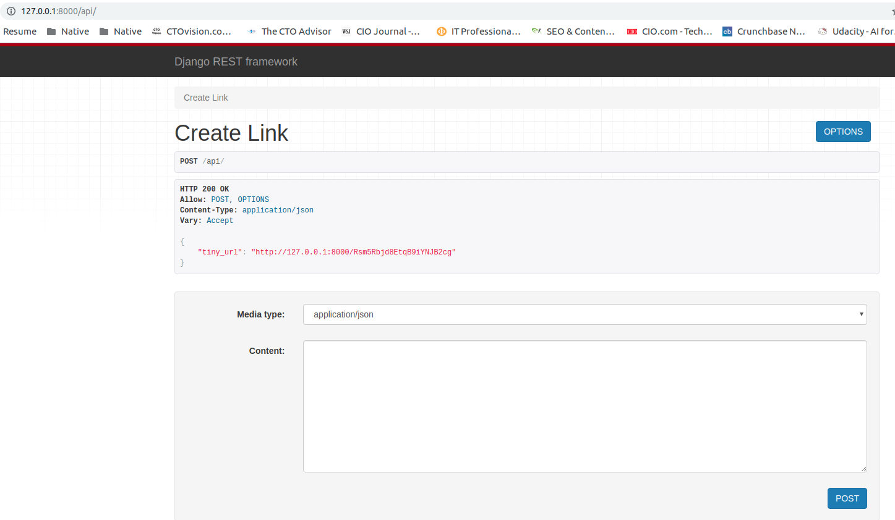
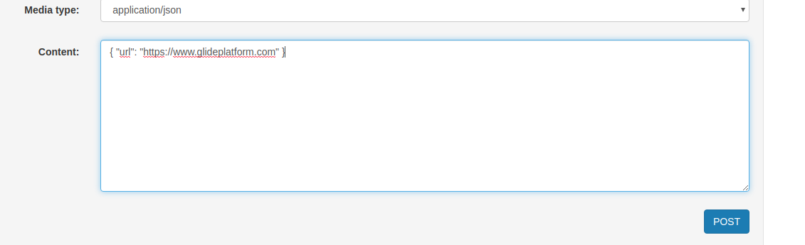

# TinyUrl: (UrlShortner) Service

## Requirement:
    Implement a URL shortener service.
    It should take any URL
    Convert the URL into a shorter form
    When the user keys in the shorter URL, service should redirect to the original URL
    Expose an API for the service
    Note:
        1. Ensure that the code is as modular as possible.
        2. Specs are must

## Solution:

## API Diagram: You can create short link by running your local server  and then go to (http://127.0.0.1:8000/api/)

## Here in content section type:
   ###  {"url": "https://www.glideplatform.com"}

## Like this

## you will get new url  like http://127.0.0.1:8000/KKe6aWJsKNTLacaHoXrTVJ

## copy this and paste in new browser window

### It Will Return the Reverse Link and you can copy and paste this link in browser and you will be redirected to main url

### Setup:

## Make Python 3 Virtual Environment

    virtualenv -p python3 toolenv

## Activate Virtualenv

     * source toolenv/bin/activate

## Now Go to Main Repo:

     * cd <repo folder>

## Install all the python dependency

     pip install -r requirement.txt

## Make Python Migrations

     ● python manage.py makemigrations

## Make Migrations

    python manage.py migrate

## Now Run The backend Server

    python manage.py runserver

### Backend Architectue

1. URL : It keeps all the Url Mapped with tiny slug

## API Structure

    * "Create Tiny url": "http://127.0.0.1:8000/api/",
    * "Redirect url": "http://127.0.0.1:8000/<slug>/",

## API View Strucutre:
    ● views.py : Redirect Url View
    ● Viewset.py : It keeps all the api viewset
    ● serializer.py : It keeps all the Input Data/Output Data formats
    ● permissons.py: It contains all the permission regarding the api endpoint

